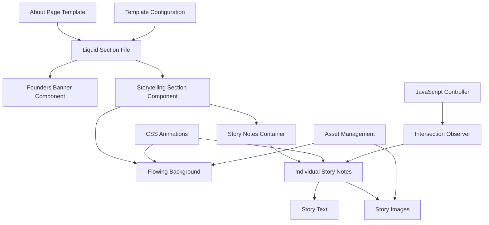

# Design Document: About Page Enhancement

## Overview

This design outlines the enhancement of an existing Shopify about page with two primary improvements: updating the founders banner image and implementing a new animated storytelling section. The solution leverages Shopify's Liquid templating system, modern CSS animations, and the Intersection Observer API for performant scroll-triggered animations while maintaining the existing scrapbook aesthetic.

## Architecture

### High-Level Architecture



### Component Hierarchy

1. **About Page Section** (sections/about-page.liquid)
   - **Founders Banner Component**
   - **Storytelling Section Component**
     - **Flowing Background Layer**
     - **Story Notes Container**
       - **Story Note Items** (8 instances)

### Technology Stack

- **Templating**: Shopify Liquid
- **Styling**: CSS3 with animations and transforms
- **JavaScript**: Vanilla JS with Intersection Observer API
- **Image Optimization**: Shopify's responsive image system
- **Configuration**: JSON schema for dynamic content management

## Components and Interfaces

### 1. Founders Banner Component

**Purpose**: Display updated founders banner image with responsive design

**Interface**:
```liquid
 Founders Banner Section 
<div class="founders-banner">
  
</div>
```

**Styling Requirements**:
- Responsive image scaling
- Maintain aspect ratio
- Smooth loading transitions
- Mobile optimization (max-width: 768px)

### 2. Storytelling Section Component

**Purpose**: Container for animated storytelling with flowing background

**Interface**:
```liquid
 Storytelling Section 
<section class="storytelling-section" id="storytelling">
  <div class="storytelling-section__background">
    
  </div>
  <div class="storytelling-section__content">
    
      
    
  </div>
</section>
```

### 3. Story Note Component

**Purpose**: Individual animated story items with alternating layout

**Interface**:
```liquid
 Story Note Item 
<div 
  class="story-note story-note--{{ block.settings.alignment | default: 'left' }}"
  data-story-index="{{ index }}"
  data-animate="fade-slide"
>
  <div class="story-note__content">
    <div class="story-note__text">
      {{ block.settings.story_text }}
    </div>
    <div class="story-note__images">
      
        
        
          
        
      
    </div>
  </div>
</div>
```

### 4. Animation Controller

**Purpose**: Manage scroll-triggered animations using Intersection Observer

**Interface**:
```javascript
class StorytellingAnimations {
  constructor() {
    this.observerOptions = {
      threshold: 0.2,
      rootMargin: '0px 0px -50px 0px'
    };
    this.init();
  }

  init() {
    this.setupIntersectionObserver();
    this.setupFlowingBackground();
  }

  setupIntersectionObserver() {
    const observer = new IntersectionObserver(
      this.handleIntersection.bind(this),
      this.observerOptions
    );
    
    document.querySelectorAll('.story-note').forEach(note => {
      observer.observe(note);
    });
  }

  handleIntersection(entries) {
    entries.forEach(entry => {
      if (entry.isIntersecting) {
        entry.target.classList.add('story-note--animated');
      }
    });
  }

  setupFlowingBackground() {
    // Continuous background animation
  }
}
```

## Data Models

### Section Schema Configuration

```json
{
  "name": "About Page Enhanced",
  "settings": [
    {
      "type": "text",
      "id": "founders_alt_text",
      "label": "Founders Banner Alt Text",
      "default": "Founders Banner"
    },
    {
      "type": "checkbox",
      "id": "enable_animations",
      "label": "Enable Animations",
      "default": true
    },
    {
      "type": "range",
      "id": "animation_duration",
      "label": "Animation Duration (ms)",
      "min": 300,
      "max": 1000,
      "step": 100,
      "default": 600
    }
  ],
  "blocks": [
    {
      "type": "story_note",
      "name": "Story Note",
      "settings": [
        {
          "type": "textarea",
          "id": "story_text",
          "label": "Story Text"
        },
        {
          "type": "select",
          "id": "alignment",
          "label": "Alignment",
          "options": [
            {"value": "left", "label": "Left"},
            {"value": "right", "label": "Right"}
          ],
          "default": "left"
        },
        {
          "type": "image_picker",
          "id": "story_image_1",
          "label": "Story Image 1"
        },
        {
          "type": "image_picker",
          "id": "story_image_2",
          "label": "Story Image 2"
        },
        {
          "type": "image_picker",
          "id": "story_image_3",
          "label": "Story Image 3"
        },
        {
          "type": "image_picker",
          "id": "story_image_4",
          "label": "Story Image 4"
        },
        {
          "type": "image_picker",
          "id": "story_image_5",
          "label": "Story Image 5"
        },
        {
          "type": "image_picker",
          "id": "story_image_6",
          "label": "Story Image 6"
        }
      ]
    }
  ],
  "presets": [
    {
      "name": "About Page Enhanced",
      "blocks": [
        {
          "type": "story_note",
          "settings": {
            "story_text": "It all began in college. We were both part of the dance society, Suhani as the Vice President and Mitanshi as the Creative Head.",
            "alignment": "left"
          }
        }
      ]
    }
  ]
}
```

### Story Content Data Structure

```javascript
const storyContent = [
  {
    id: 1,
    text: "It all began in college. We were both part of the dance society, Suhani as the Vice President and Mitanshi as the Creative Head.",
    images: ["1.1.jpg", "1.2.JPG", "1.3.JPG"],
    alignment: "left"
  },
  {
    id: 2,
    text: "When it was time to plan our seniors' farewell, we wanted to gift them something personal, something that felt like them.",
    images: ["2.1.PNG", "2.2.PNG", "2.3.PNG", "2.4.PNG"],
    alignment: "right"
  }
  // ... additional stories
];
```

Now I need to use the prework tool to analyze the acceptance criteria before writing the correctness properties.

<function_calls>
<invoke name="prework">
<parameter name="featureName">about-page-enhancement

## Correctness Properties

*A property is a characteristic or behavior that should hold true across all valid executions of a system—essentially, a formal statement about what the system should do. Properties serve as the bridge between human-readable specifications and machine-verifiable correctness guarantees.*

Based on the prework analysis and property reflection to eliminate redundancy, the following properties validate the system's correctness:

### Property 1: Responsive Design Consistency
*For any* viewport size, all page elements should maintain proper scaling, readability, and functionality without content loss or layout breaks
**Validates: Requirements 1.3, 2.4, 5.1, 5.2, 5.4**

### Property 2: Story Note Animation Triggering
*For any* story note element, when it enters the viewport, the system should apply the correct animation class based on its designated side (left/right alternating pattern)
**Validates: Requirements 3.2, 3.4**

### Property 3: Story Content and Image Association
*For any* story note, the displayed images should correspond exactly to the predefined mapping for that story's content, maintaining proper image-to-text relationships
**Validates: Requirements 4.2, 4.3**

### Property 4: Accessibility Compliance
*For any* interactive element or image, the system should provide appropriate accessibility attributes (alt text, keyboard navigation, reduced motion respect)
**Validates: Requirements 6.2, 6.3, 6.4**

### Property 5: Shopify Integration Compatibility
*For any* asset reference or CSS class, the system should maintain compatibility with Shopify's templating system and preserve existing styling hooks
**Validates: Requirements 7.3, 7.4**

### Property 6: Design System Consistency
*For any* typography or spacing element, the system should use values consistent with the existing design system and maintain visual hierarchy
**Validates: Requirements 8.2**

### Property 7: Structural Preservation
*For any* existing page element, the system should preserve the original DOM structure and CSS classes while adding new functionality
**Validates: Requirements 1.4**

### Property 8: Background Animation Continuity
*For any* flowing background element, the animation should run continuously from top to bottom without interruption or performance degradation
**Validates: Requirements 2.2**

## Error Handling

### Image Loading Failures
- **Graceful Degradation**: If CDN images fail to load, display fallback images or placeholder content
- **Alt Text Fallbacks**: Ensure meaningful alt text is always present for screen readers
- **Lazy Loading**: Implement progressive image loading to prevent blocking page render

### Animation Performance Issues
- **Reduced Motion Support**: Respect `prefers-reduced-motion` media query to disable animations
- **Intersection Observer Fallbacks**: Provide CSS-only animation fallbacks for older browsers
- **Performance Monitoring**: Use `requestAnimationFrame` for smooth animations

### Mobile Compatibility Issues
- **Viewport Adaptation**: Ensure content remains accessible on screens as small as 320px
- **Touch Target Sizing**: Maintain minimum 44px touch targets for mobile interactions
- **Orientation Changes**: Handle device rotation gracefully without layout breaks

### Shopify Template Errors
- **Liquid Syntax Validation**: Ensure all Liquid tags are properly closed and syntactically correct
- **Asset Reference Validation**: Verify all asset URLs use proper Shopify filters
- **Schema Validation**: Ensure JSON schema follows Shopify's section schema requirements

## Testing Strategy

### Dual Testing Approach

The testing strategy employs both unit tests and property-based tests to ensure comprehensive coverage:

**Unit Tests**: Focus on specific examples, edge cases, and integration points
- Specific image URL validation
- Exact story count verification (8 stories)
- Template configuration structure validation
- Specific animation class applications

**Property Tests**: Verify universal properties across all inputs using a property-based testing library
- Minimum 100 iterations per property test
- Each test tagged with: **Feature: about-page-enhancement, Property {number}: {property_text}**
- Comprehensive input coverage through randomization

### Testing Framework Selection

**For JavaScript/CSS Testing**: Jest with jsdom for DOM manipulation testing
**For Liquid Template Testing**: Shopify's Theme Inspector or custom Liquid parsing tests
**For Visual Regression**: Percy or Chromatic for cross-browser visual testing
**For Performance**: Lighthouse CI for performance regression detection

### Property Test Implementation

Each correctness property will be implemented as a single property-based test:

1. **Property 1 Test**: Generate random viewport sizes and verify responsive behavior
2. **Property 2 Test**: Generate random scroll positions and verify animation triggering
3. **Property 3 Test**: Generate random story indices and verify image associations
4. **Property 4 Test**: Generate random accessibility scenarios and verify compliance
5. **Property 5 Test**: Generate random Shopify contexts and verify integration
6. **Property 6 Test**: Generate random design elements and verify consistency
7. **Property 7 Test**: Generate random DOM modifications and verify preservation
8. **Property 8 Test**: Generate random animation states and verify continuity

### Integration Testing

- **Cross-browser Compatibility**: Test on Chrome, Firefox, Safari, and Edge
- **Device Testing**: Test on iOS Safari, Android Chrome, and various screen sizes
- **Shopify Environment**: Test within actual Shopify development store
- **Performance Benchmarks**: Ensure page load times remain under 3 seconds

### Accessibility Testing

- **Screen Reader Compatibility**: Test with NVDA, JAWS, and VoiceOver
- **Keyboard Navigation**: Verify all interactive elements are keyboard accessible
- **Color Contrast**: Ensure WCAG AA compliance for all text elements
- **Motion Sensitivity**: Verify reduced motion preferences are respected